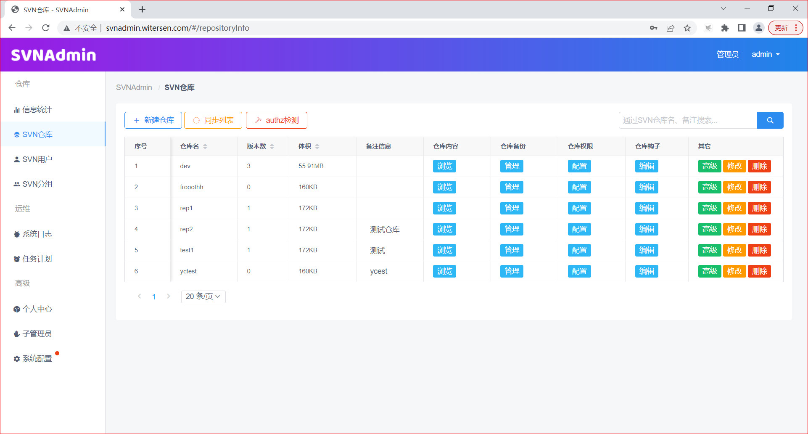

# SVNAdmin2 - 基于web的SVN管理系统

### 1. 介绍

- SVNAdmin2 是一款**通过图形界面管理服务端SVN的web程序**。

- 正常情况下配置SVN仓库的人员权限需要登录到服务器手动修改 authz 和 passwd 两个文件，当仓库结构和人员权限上了规模后，手动管理就变的非常容易出错，本系统能够识别人员和权限并提供管理和拓展功能。

- SVNAdmin2 支持**SVN协议检出、HTTP协议检出**，并且支持两种协议之间互相切换，支持docker部署或源码部署。

- SVNAdmin2 支持进行**LDAP的接入**，进而达到使用原有的人员架构和分组规则的目的。

- SVNAdmin2 第一个版本（20年初）被开发用来个人管理SVN仓库使用，无意中开源后发现用户渐多，于是开始专门维护迭代。

- [GitHub地址](https://github.com/witersen/SvnAdminV2.0)   [Gitee地址](https://gitee.com/witersen/SvnAdminV2.0)

- 问题求助、功能建议、更新计划、SVN技术讨论，可加QQ群：**633108141**

- 项目演示地址：http://svnadmin.witersen.com (管理人员/admin/admin)

- 系统截图




### 2. 兼容性

**docker > CentOS7 > CentOS8 > Rocky > Ubuntu**

Windows下如有需求，可使用 docker 版本

PHP版本：PHP 5.5+ 推荐 PHP 7.0 +

数据库：SQLite、MySQL

Subversion：1.8+


### 3. docker安装

##### 3.1 适用于：快速部署看效果

此方式可快速部署程序体验效果，数据不存储在宿主机，生产环境慎用

```
docker run -d --name svnadmintemp -p 80:80 -p 3690:3690 --privileged witersencom/svnadmin:2.5.3
```

##### 3.2 适用于：新用户正式使用

- 启动一个临时的容器用于复制配置文件出来

```
docker run -d --name svnadmintemp --privileged witersencom/svnadmin:2.5.3 /usr/sbin/init
```

- 把配置文件复制到本机的 `/home/svnadmin` 目录

```
cd /home/
docker cp svnadmintemp:/home/svnadmin ./
docker cp svnadmintemp:/etc/httpd/conf.d ./svnadmin/
docker cp svnadmintemp:/etc/sasl2 ./svnadmin/
```

- 删除掉临时容器

```
docker stop svnadmintemp && docker rm svnadmintemp
```

- 启动正式的容器

```
docker run -d -p 80:80 -p 3690:3690 \
-v /home/svnadmin/:/home/svnadmin/ \
-v /home/svnadmin/conf.d/:/etc/httpd/conf.d/ \
-v /home/svnadmin/sasl2/:/etc/sasl2/ \
--privileged \
--name svnadmin \
witersencom/svnadmin:2.5.3
```

- 进入容器内进行文件授权

```
docker exec -it svnadmin bash
chown -R apache:apache /home/svnadmin
```

##### 3.3 适用于：旧用户升级

- 2.4.x 之前的用户升级到2.4.x （可以联网的用户）
  - 进入容器内
  - yum install -y unzip
  - cd /var/www/html/server && php install.php
  - 退出容器
  - 停止旧的容器，拉取新容器，挂载本地的数据目录到新版本的容器即可
- 2.4.x 之前的用户升级到2.4.x （不可联网的用户）
  - 在有网络的环境下下载升级包，注意下载 update.tar.gz 而不是 update.zip
  - 提前下载好升级包并复制到容器中 /var/www/html/server/ 目录下
  - cd /var/www/html/server/
  - tar -zxvf update.tar.gz
  - php update/index.php
  - 退出容器
  - 停止旧的容器，拉取新容器，挂载本地的数据目录到新版本的容器即可
- 2.4.3 及之前的用户升级到 2.4.x 要注意目录挂载多了 conf.d sasl2 升级之前要提前复制出来
- 2.4.x之前的用户升级到2.5.x
  - 请等作者闲了做升级包。。。。。。
- 2.4.x 升级到 2.5.x
  - 请等作者闲了做升级包。。。。。。。
- 2.5.x 版本之间升级
  - 只需要停掉老容器，按照之前的文件、端口映射配置，拉取新容器启动即可

### 4. 源码安装

svnadmin = web系统 + 后台进程，因此安装注意噢

##### 4.1 适用于：CentOS7、Rocky等

- 安装解压缩等工具

```
yum install -y zip unzip wget vim which
```

- 安装sasl相关依赖（svn协议检出配置sasl认证如ldap要用到）

```
yum install -y cyrus-sasl cyrus-sasl-lib cyrus-sasl-plain
```

- 安装PHP和相关扩展（CentOS7默认源中提供的PHP版本为5.4，而我们需要 5.5+，因此使用remi源）

```
yum install -y epel-release yum-utils
rpm -Uvh https://mirrors.aliyun.com/remi/enterprise/remi-release-7.rpm
yum-config-manager --enable remi-php74

yum install -y php php-common php-cli php-fpm php-mysqlnd php-mysql php-pdo php-process php-json php-gd php-bcmath php-ldap
```

- 安装web服务器（推荐 apache 可使用http协议检出）

```
yum install -y httpd mod_dav_svn mod_ldap
systemctl start httpd
systemctl enable httpd
```

- 安装任务计划组件（任务计划功能用到）

```
yum install -y cronie at
```

- 下载解压代码包

```
cd /var/www/html/ && wget https://gitee.com/witersen/SvnAdminV2.0/releases/download/v2.5.3/2.5.3.zip

unzip v2.5.3.zip
```

- 安装Subversion（如果你安装过Subversion，本步骤可以略过）（注意需要Subversion >= 1.8）

```
cd /var/www/html/server/
chown -R apache:apache /var/www/html/
#选项1
php install.php
```

- 修改Subversion的配置使其支持被本系统管理

```
cd /var/www/html/server
#选项1或选项2
php install.php
```

- 为数据目录授权属主和属组。php脚本web调用是以apache身份执行，因此apache用户需要对数据目录有权
- 如果你使用其它web服务器如nginx tomcat 可以通过浏览器访问 你的机器IP/server/own.php 来获取属主和属组

```
chown -R apache:apache /home/svnadmin
```

- 手动启动后台进程（启动方式一）

  ```
  #pwd
  /var/www/html
  
  #后台运行
  nohup php svnadmind.php start >/dev/null 2>&1 &
  #后台运行后exit退出一下 保证后台稳定运行
  exit
  
  #停止后台
  php svnadmind.php stop
  
  #调试模式
  php svnadmind.php console
  ```

- 通过系统管理启动后台进程（启动方式二）

  - 新建系统服务文件 svnserve.service（centos一般为 /usr/lib/systemd/system/svnadmind.service、ubuntu 一般为 /lib/systemd/system/svnadmind.service）
    - 写入以下内容（注意根据自己的代码部署路径调整）

  ```
  [Unit]
  Description=SVNAdmin
  After=syslog.target network.target
  
  [Service]
  Type=simple
  ExecStart=/usr/bin/php /var/www/html/server/svnadmind.php start
  
  [Install]
  WantedBy=multi-user.target
  ```

    - 操作服务

  ```
  #启动
  systemctl daemon-reload
  systemctl start svnadmind
  
  #查看状态
  systemctl status svnadmind
  
  #加入开机自启动
  systemctl enable svnadmind
  ```

##### 4.2 适用于：宝塔面板

- 安装方式跟手动部署类似，只是宝塔系统了很多可视化操作很方便

- 参考视频：[SVNAdmin V2.2.1 系统部署与使用演示视频【针对宝塔面板】]( https://www.bilibili.com/video/BV1XR4y1H7p3?share_source=copy_web&vd_source=f4620db503611c42618f1afd9c8afecd) 

##### 4.3 适用于：ubutntu18

- 步骤同1（注意需要以root用户执行 server/install.php 和 server/svnadmind.php ）
- 在ubuntu中软件包名称多与CentOS系列不同，需要用户自行处理

```
sudo apt-get update

sudo apt-get install -y apache2
sudo apt-get install -y php
sudo apt-get install -y php-cli
sudo apt-get install -y php-fpm

sudo a2enmod proxy_fcgi setenvif
sudo systemctl restart apache2
sudo a2enconf php7.2-fpm
sudo systemctl reload apache2

sudo apt-get install -y php-json

sudo apt-get install -y php7.2-mysql
sudo apt-get install -y php-mysql

sudo apt-get install -y sqlite3

sudo apt-get install -y php7.2-sqlite

sudo apt-get install -y php-gd

sudo systemctl restart apache2

sudo apt-get install -y subversion subversion-tools

cd /var/www/html

wget xxx.zip

unzip xxx.zip

#选项2
sudo server/install.php

chown -R apache:apache /home/svnadmin/

su root

nohup php server/svnadmind.php start &
```

##### 4.4 适用于：旧用户升级

- 2.4.x 之前的用户升级到2.4.x
  - yum install -y unzip
  - cd /var/www/html/server && php install.php
  - yum install -y unzip cyrus-sasl cyrus-sasl-lib cyrus-sasl-plain mod_dav_svn mod_ldap mod_php php-ldap cronie at
  - httpd -k graceful （如果web服务器不是apache则不需要重启）
  - chown -R apache:apache /home/svnadmin/（如果web服务器不是apache可看上方关于 own.php 使用说明）
  - php svnadmind.php stop
  - nohup svnadmind.php start & （如果你有自己的启动方式则使用自己的启动方式）
- 2.4.x 之后的升级
  - 执行 `php code/server/install.php`，没有升级包则需要手动升级
  - 手动升级，直接重新下载安装包覆盖之前的代码即可
  - 由于下载的新代码没有之前的配置信息，所重新修改自己的配置文件
    - 数据库配置信息`web/config/database.php`
    - 主目录配置信息 `web/config/svn.php`
    - 二进制文件配置文件 `web/config/bin.php`
- 2.4.x之前升级到2.5.x
  - 请等作者闲了做升级包。。。。。。
- 2.4.x升级到2.5.x
  - 请等作者闲了做升级包。。。。。。
- 2.5.x之间升级
  - 只需要重新覆盖代码即可

### 5. 常见问题解答

##### 5.1 使用此系统管理管理之前的仓库 ？

- 确认之前SVN仓库的版本，如果是1.8+则无需担心，如果是1.8以下，则需要简单升级下仓库

- 安装本系统
- 执行 php server/install.php  使用内置的功能重新配置你的Subversion
- 将已有的一个或多个SVN仓库移动到 /home/svnadmin/rep/ 目录下 
- 在导航**SVN仓库**中执行**同步列表**，即可识别SVN仓库
- 注意：如果你原来是一个仓库一套配置文件的方式，则还需要按照截图的方式稍微调整下你的配置文件。因为现在是多个仓库一套配置文件的管理方式。


##### 5.2 如何将数据库切换为MySQL ？

- 创建数据库 svnadmin
- 将安装包中的MySQL文件 templete/database/mysql/svnadmind.sql 导入数据库
- 修改 config/database.php 将sqlite部分注释并配置你的MySQL即可
- 注意：若php版本过低而MySQL版本>=8.0，则会提示：The server requested authentication method unknown to the client，只需要升级php版本或者修改MySQL数据库的配置信息即可

##### 5.3 为什么只支持管理Subversion1.8+ ？

- 因为目前是通过多个仓库读取一套配置文件的方式，而subversion1.8+才支持这种方式
- 预计在 2.5.x 版本向下适配，支持管理 Subversion 1.5+

##### 5.4 为什么目前只支持Linux操作系统 ？

- 系统中使用了一些多进程的方案，而这在Windows下实现需要花费更多的时间

- 短期内没有支持Windows部署的计划
- Windows下使用可通过docker版本

##### 5.5 仓库初始化结构模板 ？

- 我们可以在创建仓库的时候选择创建指定内容结构的仓库，如包含 "trunk" "branches" "tags" 文件夹的结构，这一结构是可选的并且可调整的，我们可以手动调整 /home/svnadmin/templete/initStruct/01/ 下的目录结构

##### 5.6 常用钩子推荐 ？

- 我们可以在目录 /home/svnadmin/hooks/ 下增加自己常用的钩子 
  - /home/svnadmin/hooks/ 下建立文件夹 xx，名称任意
  - 在 xx 下新建文件 hookDescription 写入对此钩子的描述文本内容
  - 在 xx 下新建文件 hookName 写入钩子类型，如post-commit等
  - 在 xx 下新建文件 ，以钩子类型命名，如 post-commit ，然后写入具体钩子内容

##### 5.7 管理员找回密码

- 使用默认的SQLite数据库
```
#使用sqlite数据库

yum install -y sqlite-devel

cd /home/svnadmin

sqlite3 svnadmin.db

.header on

.mode column

select * from admin_users;
```

- 使用MySQL数据库
  - 使用可视化工具登录到数据库查看 admin_users 数据表信息即可

##### 5.8 关于大文件下载中断问题

- 当下载1G以及以上的大文件会出现下载被中断的问题，是因为文件下载为了安全没有使用http文件直链，而是通过php校验后读取文件流下载，所以会存在一个php-fpm最大执行时间的问题，因此你可以通过 设置 php-fpm.conf 配置文件的 request_terminate_timeout 为0 来取消超时限制

##### 5.9 如果配置了多个仓库模板，如何在创建仓库时指定使用某个仓库模板？

```
例如： 
在 /home/svnadmin/templete/initStruct/01 下面配置第一个仓库结构模板
在 /home/svnadmin/templete/initStruct/02 下面配置第二个仓库结构模板
如果在web中创建时，如何选用默认的 /home/svnadmin/templete/initStruct/02 下面的仓库结构模板？
【解决方案】
由于时间问题，开发时并没有对此功能做更多的详细开发，因此只预留了配置文件层面的修改途径，后续会将仓库模板功能加入到web配置，无需手动命令行管理
可以通过修改 config/svn.php 中的 templete_init_struct_01 值来修改
```

##### 5.10 配置了自定义仓库模板但是创建仓库时没有生效

```
注意配置自定义仓库模板的位置 
通常的位置在 /home/svnadmin/templete/initStruct/01 下面 
而不是在项目代码相关的位置
```

##### 5.11 数据长度超过8192 请向上调整参数：SOCKET_READ_LENGTH

```
【出现问题原因】
svn的用户量和权限配置数量增加，超过了默认值
【解决方案】
修改 config/daemon.php 文件中的 SOCKET_READ_LENGTH 和 SOCKET_WRITE_LENGTH 
设置到133693415 字节也就是大约小于128M貌似都是可以的，再大没有测试过
修改后别忘记要重启守护进程，重启守护进程的方式根据安装方式的不同而不同（不重启会出问题）
【适用版本】
2.1.0+
```

##### 5.12 提示无法连接到LDAP服务器

```
确定以下两点
1、你的 ldap 服务器地址和端口真实有效
2、安装 svnadmin2 的机器确实可以通过 ldap 端口与你的 ldap 服务所在服务器通信

然后检查 svnadmin2 所在机器的 selinux 配置，通常 selinux 会禁止 http 连接 ldap
执行：
getsebool -a | grep ldap
如果得到以下结果：
httpd_can_connect_ldap --> off
证明需要我们手动开启 httpd_can_connect_ldap 这个选项
执行以下指令允许连接即可
setsebool -P httpd_can_connect_ldap=1

以上情况为 selinux 开启可能出现的，当关闭 selinux 后以上配置不再起作用
```

##### 5.13 LDAP启用状态下用户已授权但是无权限浏览仓库

```
这种情况通常是因为源码安装过程中，少装了有关ldap 的模块或依赖，建议详细看文档
```

##### 5.14 LDAP状态下用户列表同步成功但是无法登录（2.4.x版本之前的问题）

```
这种情况下通常是因为你的 Base DN 配置问题
假设
你的 base dn 填写为：dc=witersen,dc=com
你的 Attributes 填写为： cn
然后你过滤出用户：blue
那么 blue 作为一个 SVN 用户来登录系统的时候，系统会将 cn=blue,dc=witersen,dc=com 来作为用户 blue 的完整 dn 并且结合用户输入的密来一起请求 ldap 服务器进行校验，所以如果 blue 用户的真实 dn 是 cn=blue,ou=devGroup,dc=witersen,dc=com 就会造成同步成功登录失败的情况
```


### 6. :heart: 捐赠感谢

- 本人工作之余大部分的时间精力都投入在了 SVNAdmin2
- 如果有可能，希望得到各位使用者的捐赠鼓励，捐赠更多代表的是认可，作者会继续动力更新的！

| 捐赠者            | 渠道   | 时间       |
| ----------------- | ------ | ---------- |
| qq@穿裤衩的狐狸   | QQ     | 2021-08-19 |
| qq@cat            | 微信   | 2022-10-10 |
| qq@Listen_        | 微信   | 2022-11-16 |
| qq@小吴飞刀丶mike | 微信   | 2022-11-16 |
| gitee@tango_zhu   | Gitee  | 2022-11-18 |
| qq@三多～(๑°3°๑)  | 支付宝 | 2022-11-28 |
| wechat@Z*h        | 微信   | 2022-11-30 |
| qq@三多～(๑°3°๑)  | 支付宝 | 2022-12-06 |
| qq@ArtOfTerRan。  | 微信   | 2022-12-07 |
| qq@Captcha        | 支付宝 | 2022-12-12 |
| qq@Start          | 支付宝 | 2022-12-16 |
| alipay@*通        | 支付宝 | 2023-01-06 |
| qq@面壁人         | 微信   | 2023-01-13 |
| qq@☆星雨星辰☆     | 微信   | 2023-03-02 |
| qq@东方启示录     | 微信   | 2023-03-06 |


