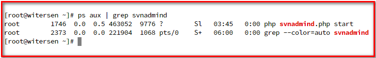
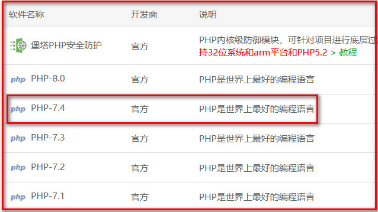
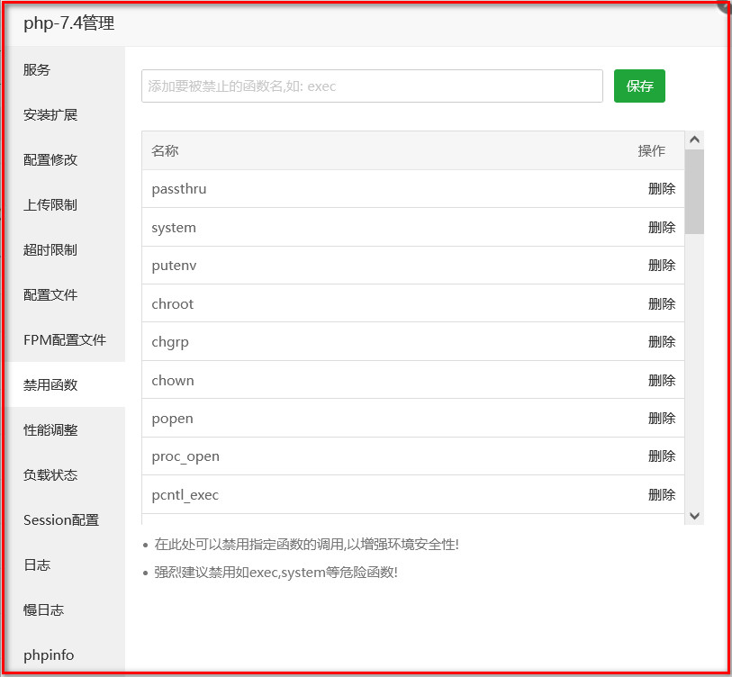
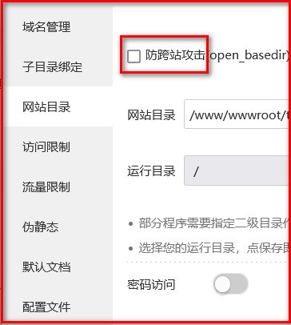
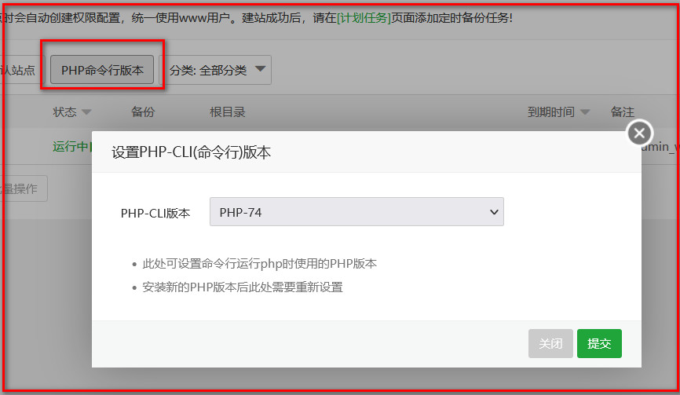
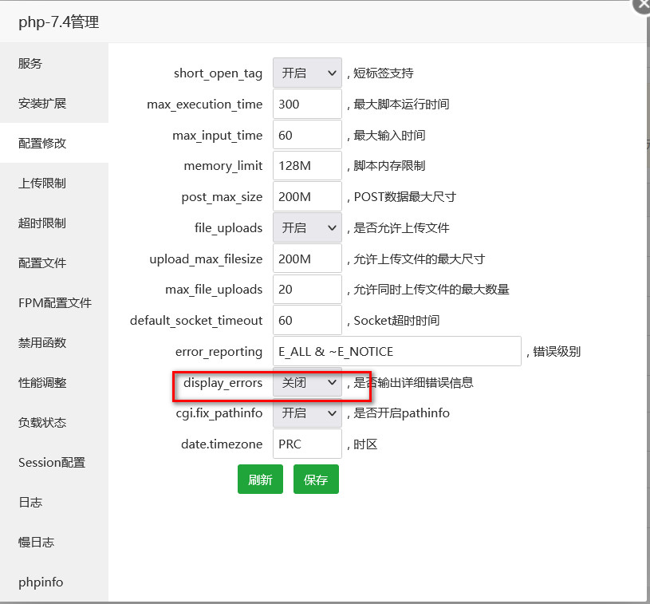

# SVNAdmin 系统部署与使用手册
1、该系统为使用PHP开发的Subversion（SVN）的web管理界面 是搭建svn服务器的神器 可一分钟安装使用！

2、目前支持CentOS 8、CentOS7系统 PHP版本要求为 PHP 7 >= 7.3.0, PHP 8

3、演示地址：http://svnadmin.witersen.com (默认的用户名与密码都为 administrator)

4、GitHub地址：https://github.com/witersen/SvnAdminV2.0 Gitee地址：https://gitee.com/witersen/SvnAdminV2.0

5、可以加入群聊讨论遇到的问题 <a target="_blank" href="https://qm.qq.com/cgi-bin/qm/qr?k=DdSr3ht7keIaqpvw2Xwd6TpyRAFd3h9D&jump_from=webapi">

</a>

## 一 、系统部署 - CentOS8.2裸机

### （1）安装 PHP 7.4 及依赖

```
yum install -y zip unzip wget                 #压缩与解压缩和下载工具
yum module list php                           #查看可用的PHP模块
yum module -y enable php:7.4                  #启用PHP7.4，默认为启用PHP7.2
yum install -y php                            #安装PHP7.4
yum install -y php-process                    #pentl扩展和posix扩展
yum install -y php-json                       #json相关函数

```

### （2）安装 Web 服务器
```
yum install -y httpd                #安装Apache
systemctl start httpd               #开启Apache
systemctl enable httpd              #将Apache加入开机自启动
systemctl restart php-fpm           #重启php-fpm

```

### （3）下载并解压部署程序
- 在控制台 执行以下命令 将数据库文件移动到指定位置
```
cd /var/www/html
wget https://gitee.com/witersen/SvnAdminV2.0/attach_files/916329/download/v2.2.zip
unzip v2.2.zip
chmod 777 -R /var/www/html/config
mkdir -p /home/svnadmin/rep

```

### （4）启动后台程序

- 进入程序代码的server目录，在命令行下以root用户身份执行以下命令

```
cd /var/www/html/server
php svnadmind.php start

```

-  执行以下命令用来查看程序的server端是否正常运行

```
ps aux | grep svnadmind

```

- 如图所示，可看到服务端程序正常运行在后台


### （5）web 访问测试

- 访问部署主机地址，可看到程序的登录页信息，代表部署成功

- 可使用默认的用户名(administrator)与密码(administrator)访问

## 二 、系统部署 - 基于CentOS的宝塔面板

### （1）安装 PHP 7.4



### （2）解禁 PHP7.4 禁用的函数

- 解禁PHP7.4中 pcntl_signal、pcntl_fork、pcntl_wait、shell_exec 四个被宝塔面板默认禁用的函数


### （3）创建站点 关闭网站设置中的 open_basedir 



### （4）将PHP的命令行版本更换至安装的PHP7.4



### （5）记得关闭PHP7.4的 错误输出



### （5）下载并解压部署程序
- 在网站目录切换到宝塔控制台 执行以下命令 将数据库文件移动到指定位置
```
wget https://gitee.com/witersen/SvnAdminV2.0/attach_files/916329/download/v2.2.zip
unzip v2.2.zip
chmod 777 -R config
mkdir -p /home/svnadmin/rep

```

### （6）启动后台程序

- 进入程序代码的server目录，在宝塔控制台下以root用户身份执行以下命令

```
cd /var/www/html/server
php svnadmind.php start

```

-  执行以下命令用来查看程序的server端是否正常运行

```
ps aux | grep svnadmind

```

- 如图所示，可看到服务端程序正常运行在后台
  

### （7）web 访问测试

- 访问部署主机地址，可看到程序的登录页信息，代表部署成功

- 可使用默认的用户名(administrator)与密码(administrator)访问

## 三、将已有的SVN仓库使用此系统管理

- （1）安装本系统
- （2）通过系统服务管理界面安装Subversion
- （3）将已有的一个或多个SVN仓库移动到 /home/svnadmin/rep/ 目录下 
- （4）刷新管理系统的仓库管理页面即可识别SVN仓库
- （5）注意此方式并不会识别SVN仓库原有的用户以及权限配置，因为我们使用了统一的配置文件来进行用户和权限管理，因此迁移仓库后还需要在管理系统重新添加用户、用户组、配置权限！