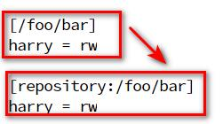
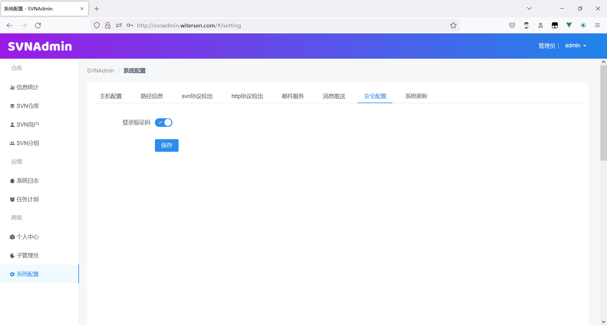
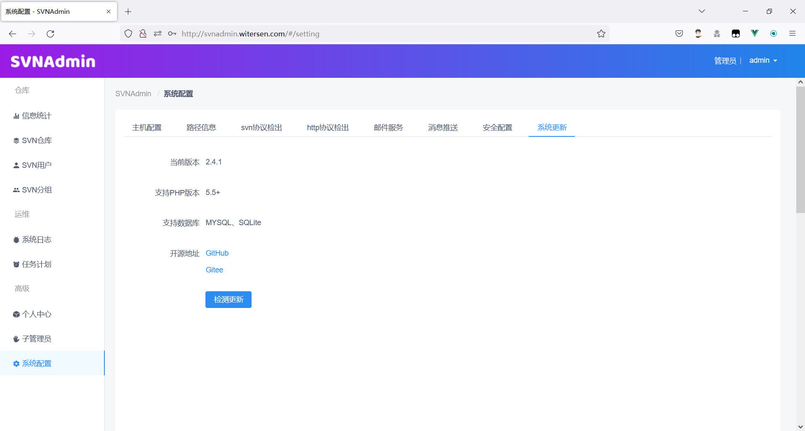

# SVNAdmin - 开源SVN管理系统
- 基于web的Subversion（SVN）服务器端管理工具
- 支持http协议、SVN协议、支持SASL（ldap）认证、docker部署
- 演示地址：http://svnadmin.witersen.com (默认的用户名与密码都为 admin)
- 项目地址：
  - GitHub地址：https://github.com/witersen/SvnAdminV2.0 
  - Gitee地址：https://gitee.com/witersen/SvnAdminV2.0
- 发行包：
  - GitHub：https://github.com/witersen/SvnAdminV2.0/releases/download/v2.3.3.1/2.3.3.1.zip
  - Gitee：https://gitee.com/witersen/SvnAdminV2.0/releases/download/v2.3.3.1/2.3.3.1.zip
- 兼容性

  - 本程序提供 docker 镜像，基于 centos7.9.2009 构建

  - 操作系统（手动安装）：CentOS7（推荐）、CentOS8、Rocky、Ubuntu（Windows及其它Linux发行版正在测试兼容中）
  - PHP版本：PHP 5.5+ 推荐 PHP 7.0 +
  - 数据库：SQLite、MySQL
  - Subversion：1.8+
- 问题协助或功能建议加Q群：633108141
- **由于此版本改动较大，老用户都需要等待升级包升级**（除非舍弃你的数据库重新安装）

## 一、docker安装

- **如果要使用http协议检出，建议使用docker安装方式**
- 拉取镜像

```
docker pull witersencom/svnadmin:2.4.1
```

- 仅运行查看效果（不挂载宿主机的目录）

```
docker run -d \
--name svnadmintemp \
-p 80:80 \
-p 3690:3690 \
--privileged \
witersencom/svnadmin:2.4.1
```

- 正式使用（新用户）（挂载宿主机目录）

  - 启动一个临时容器

  ```
  docker run -d --name svnadmintemp --privileged witersencom/svnadmin:2.4.1 /usr/sbin/init
  ```

  - 把配置文件复制出来（复制的数据在宿主机 /home/svnadmin）

  ```
  cd /home/ && docker cp svnadmintemp:/home/svnadmin ./
  ```

  - 删除临时容器

  ```
  docker stop svnadmintemp && docker rm svnadmintemp
  ```

  - 启动正式容器

  ```
  docker run -d \
  -p 80:80 \
  -p 3690:3690 \
  -v /home/svnadmin/:/home/svnadmin/ \
  --privileged \
  --name svnadmin
  witersencom/svnadmin:2.4.1
  ```

  - 容器内授权

  ```
  docker exec -it svnadmin bash
  chown -R apache:apache /home/svnadmin
  ```

- 正式使用（老用户）（挂载主机目录）
  
  - 由于本次更新改动较大 2.4.1之前的版本升级到2.4.1需要升级包 请耐心等待


## 二、手动安装

### 1、在CentOS7.6/Rocky安装

- 安装解压缩等工具

```
yum install -y zip unzip wget vim which
```

- 安装sasl相关依赖（svn协议检出配置sasl认证如ldap要用到）

```
yum install -y cyrus-sasl cyrus-sasl-lib cyrus-sasl-plain
```

- 安装PHP和相关扩展（CentOS7默认源中提供的PHP版本为5.4，而我们需要 5.5+，因此使用remi源）

```
yum install -y epel-release yum-utils
rpm -Uvh https://mirrors.aliyun.com/remi/enterprise/remi-release-7.rpm
yum-config-manager --enable remi-php74

yum install -y php php-common php-cli php-fpm php-mysqlnd php-mysql php-pdo php-process php-json php-gd php-bcmath php-ldap
```

- 安装web服务器（推荐 apache 可使用http协议检出）

```
yum install -y httpd mod_dav_svn
systemctl start httpd
systemctl enable httpd
```

- 安装任务计划组件（任务计划功能用到）

```
yum install -y cronie at
```

- 下载解压代码包

```
cd /var/www/html/ && wget https://gitee.com/witersen/SvnAdminV2.0/releases/download/v2.4.1/2.4.1.zip

unzip v2.4.1.zip
```

- 安装Subversion（如果你安装过Subversion，本步骤可以略过）（注意需要Subversion >= 1.8）

```
cd /var/www/html/server/
#选项1
php install.php
```

- 修改Subversion的配置使其支持被本系统管理

```
cd /var/www/html/server
#选项1或选项2
php install.php
```

- 为数据目录授权属主和属组。php脚本web调用是以apache身份执行，因此apache用户需要对数据目录有权
- 如果你使用其它web服务器如nginx tomcat 可以通过浏览器访问 你的机器IP/server/own.php 来获取属主和属组

```
chown -R apache:apache /home/svnadmin
```

- 手动启动后台进程（启动方式一）

  ```
  #pwd
  /var/www/html
  
  #后台运行
  nohup php svnadmind.php start >/dev/null 2>&1 &
  
  #停止后台
  php svnandmin.php stop
  
  #调试模式
  php svnadmin.php console
  ```

- 通过系统管理启动后台进程（启动方式二）

  - 新建系统服务文件 svnserve.service（centos一般为 /usr/lib/systemd/system/svnserve.service、ubuntu 一般为 /lib/systemd/system/svnserve.service）
    - 写入以下内容（注意根据自己的代码部署路径调整）

  ```
  [Unit]
  Description=SVNAdmin
  After=syslog.target network.target
  
  [Service]
  Type=simple
  ExecStart=/usr/bin/php /var/www/html/server/svnadmind.php start
  
  [Install]
  WantedBy=multi-user.target
  ```

    - 操作服务

  ```
  #启动
  systemctl daemon-reload
  systemctl start svnadmind
  
  #查看状态
  systemctl status svnadmind
  
  #加入开机自启动
  systemctl enable svnadmind
  ```

### 2、在宝塔面板安装

- 安装方式跟手动部署类似，只是宝塔系统了很多可视化操作很方便

- 参考视频：[SVNAdmin V2.2.1 系统部署与使用演示视频【针对宝塔面板】]( https://www.bilibili.com/video/BV1XR4y1H7p3?share_source=copy_web&vd_source=f4620db503611c42618f1afd9c8afecd) 

### 3、在ubutntu18安装

- 步骤同1（注意需要以root用户执行 server/install.php 和 server/svnadmind.php ）
- 在ubuntu中软件包名称多与CentOS系列不同，需要用户自行处理

```
sudo apt-get update

sudo apt-get install -y apache2
sudo apt-get install -y php
sudo apt-get install -y php-cli
sudo apt-get install -y php-fpm

sudo a2enmod proxy_fcgi setenvif
sudo systemctl restart apache2
sudo a2enconf php7.2-fpm
sudo systemctl reload apache2

sudo apt-get install -y php-json

sudo apt-get install -y php7.2-mysql
sudo apt-get install -y php-mysql

sudo apt-get install -y sqlite3

sudo apt-get install -y php7.2-sqlite

sudo apt-get install -y php-gd

sudo systemctl restart apache2

sudo apt-get install -y subversion subversion-tools

cd /var/www/html

wget xxx.zip

unzip xxx.zip

#选项2
sudo server/install.php

chown -R apache:apache /home/svnadmin/

su root

nohup php server/svnadmind.php start &
```

## 三、FAQ

### 1、如何将已有的SVN仓库使用此系统管理 ？

- （1）安装本系统
- （2）执行 php server/install.php  使用内置的功能重新配置你的Subversion
- （3）将已有的一个或多个SVN仓库移动到 /home/svnadmin/rep/ 目录下 
- （4）刷新管理系统的仓库管理页面即可识别SVN仓库
- （5）注意此方式并不会识别SVN仓库原有的用户以及权限配置，因为我们使用了统一的配置文件来进行用户和权限管理，因此迁移仓库后还需要在管理系统重新添加用户、用户组、配置权限！



### 2、如何将数据库切换为MySQL ？

- 创建数据库

- 将系统提供的 mysql 数据库文件导入到你的MySQL数据库

- 修改 config/database.php 将sqlite部分注释并配置你的MySQL即可
- 注意：若php版本过低而MySQL版本>=8.0，则会提示：The server requested authentication method unknown to the client，只需要升级php版本或者修改MySQL数据库的配置信息即可

### 3、为什么只支持管理Subversion1.8+ ？

- 预计在 2.5.x 版本向下适配，支持管理 Subversion 1.5+

### 4、为什么目前只支持Linux操作系统 ？

- 正在使用新方案对Windows操作系统进行支持测试
- ~~预计在 2.4.x 版本支持 Windows 部署~~

### 5、仓库初始化结构模板 ？

- 我们可以在创建仓库的时候选择创建指定内容结构的仓库，如包含 "trunk" "branches" "tags" 文件夹的结构，这一结构是可选的并且可调整的，我们可以手动调整 /home/svnadmin/templete/initStruct/01/ 下的目录结构

### 6、常用钩子推荐 ？

- 我们可以在目录 /home/svnadmin/hooks/ 下增加自己常用的钩子 
  - /home/svnadmin/hooks/ 下建立文件夹 xx，名称任意
  - 在 xx 下新建文件 hookDescription 写入对此钩子的描述文本内容
  - 在 xx 下新建文件 hookName 写入钩子类型，如post-commit等
  - 在 xx 下新建文件 ，以钩子类型命名，如 post-commit ，然后写入具体钩子内容
- 感谢 【北方糙汉子-】提供的钩子脚本

### 9、管理员找回密码

- 使用默认的SQLite数据库
```
#使用sqlite数据库

yum install -y sqlite-devel

cd /home/svnadmin

sqlite3 svnadmin.db

.header on

.mode column

select * from admin_users;
```

- 使用MySQL数据库
  - 使用可视化工具登录到数据库查看 admin_users 数据表信息即可

### 10、关于大文件下载中断问题

- 当下载1G以及以上的大文件会出现下载被中断的问题，是因为文件下载为了安全没有使用http文件直链，而是通过php校验后读取文件流下载，所以会存在一个php-fpm最大执行时间的问题，因此你可以通过 设置 php-fpm.conf 配置文件的 request_terminate_timeout 为0 来取消超时限制

### 11、容器重启后无法正常访问web服务（svn不受影响）

```
【原因】 
重启容器后，容器内的 httpd 由于一些原因没有成功重启 
1、构建的 docker 镜像是以 CentOS7.9.2009 为基础进行的 
由于 CentOS7.9.2009 基础镜像的权限问题：https://github.com/docker-library/docs/tree/master/centos#dockerfile-for-systemd-base-image 
导致如果启动容器时不增加 --privileged 参数 和不以 /usr/sbin/init 作为首先执行的指令，将会导致容器内一些程序无法正常启动 
2、另外不排除重启后再次启动 httpd 时由于上次的 httpd.pid 文件依然造成的识别未 httpd 运行中的误判 
【解决方案】 
如果重启容器后 web 管理系统无法访问 
只需要进入容器并执行下面的命令重新启动 httpd 服务即可 
/usr/sbin/httpd 
后面会考虑更换更方便的解决方案
```

### 12、如果配置了多个仓库模板，如何在创建仓库时指定使用某个仓库模板？

```
例如： 
在 /home/svnadmin/templete/initStruct/01 下面配置第一个仓库结构模板
在 /home/svnadmin/templete/initStruct/02 下面配置第二个仓库结构模板
如果在web中创建时，如何选用默认的 /home/svnadmin/templete/initStruct/02 下面的仓库结构模板？
【解决方案】
由于时间问题，开发时并没有对此功能做更多的详细开发，因此只预留了配置文件层面的修改途径，后续会将仓库模板功能加入到web配置，无需手动命令行管理
可以通过修改 config/svn.php 中的 templete_init_struct_01 值来修改
```

### 13、docker版本要修改容器内 svn 的 3690 默认端口 

```
【解释】 
既然使用 docker 版本，则无需考虑容器内应用的端口，因为可通过容器启动时候做端口映射 
docker版本因为处于容器中权限问题禁用了一些按钮的操作权限，如修改svn服务的端口和绑定主机等信息 
假如启动容器时，映射关系为 3691:3690 表示宿主机3691映射到容器的3690，因此在容器中修改3690为3692，会导致宿主机的3691无法提供服务 
后面会改进 docker 版本，尽量令使用体验跟原生机器一致 
【修改端口方案】 
法1 
直接在容器启动时即指定宿主机的映射端口，如 3692:3690 这样在容器中的管理系统查看还是3690，但是宿主机通过 3692 提供svn服务 
法2（通过提供的dockefile自己重构docker镜像） 
修改所有文件中的3690端口为想要的端口如3692 
之后通过 docker build . -t svnadmin:xxx-edit 即可得到标签为 svnadmin:xxx-edit 的自定义构建镜像 
这样的做法好处为管理系统查看到的端口为3692，启动docker时候映射端口的写法也可为 3692:3692
```

### 15、配置了自定义仓库模板但是创建仓库时没有生效

```
注意配置自定义仓库模板的位置 
通常的位置在 /home/svnadmin/templete/initStruct/01 下面 
而不是在项目代码相关的位置
```

### 16、数据长度超过8192 请向上调整参数：SOCKET_READ_LENGTH

```
【出现问题原因】
svn的用户量和权限配置数量增加，超过了默认值
【解决方案】
修改 config/daemon.php 文件中的 SOCKET_READ_LENGTH 和 SOCKET_WRITE_LENGTH 
设置到133693415 字节也就是大约小于128M貌似都是可以的，再大没有测试过
修改后别忘记要重启守护进程，重启守护进程的方式根据安装方式的不同而不同（不重启会出问题）
【适用版本】
2.1.0+
```

### 17、登录时二维码总是提示输入错误

```
【出现问题原因】 
首次登录数据信息默认使用sqlite数据库 
由于部署问题或其它问题造成数据库文件 /home/svnadmin/svnadmin.db 没有权限 
【解决方案】 
为sqlite数据库文件和文件所在目录授权777 
chmod 777 /home/svnadmin/svnadmin.db 
chmod 777 -R /home/svnadmin 
如果是容器部署，需要在容器中执行此操作而不是在宿主机执行
```

### 18、关于修改数据存储主目录后的升级

```
修改过数据存储主目录的，升级新版本程序需要注意：
升级后程序的配置还是默认的目录路径不是修改过的路径
需要做以下修改
1、停止后台程序 php server/svnadmind.php stop
2、修改配置文件 config/svn.php 中的一处默认路径 /home/svnadmin/ 为自己配置的路径
3、停止 svnserve 服务 systemctl stop svnserve 或者直接 kill pid
4、修改 svnserve 的服务文件中的两处默认路径 /home/svnadmin/ 为自己配置的路径
5、启动后台程序和启动 svnserve 服务

会在下个版本简化升级步骤并解决此问题
```

## 四、功能介绍

- 系统支持三种角色：管理员、子管理员、SVN用户


- 首页系统概览


- 仓库管理


- 自定义仓库结构


- 在线浏览仓库结构


- 仓库备份


- 在线授权


- 授权对象列表


- 权限反转


- 仓库钩子


- 仓库详细信息


- 创建SVN用户


- 查看SVN用户有权限仓库路径列表


- 二次授权功能推荐


- 二次授权授权对象


- 分组成员编辑


- 系统操作日志


- 任务计划进行仓库备份、仓库检查、自定义shell操作


- 任务计划日志


- 个人中心修改密码


- 子管理员


- 子管理员支持权限树配置


- 主机配置


- 路径信息


- 支持SVN协议检出，通知支持SVN协议配置SASL中的LDAP认证


- 支持http协议检出，同时支持对接LDAP认证


- 状态切换方便


- 邮件服务配置


- 消息推送


- 安全配置-验证码



- 检查更新




## 五、最后

### :heart: 捐赠感谢

- 感谢各位使用者的鼓励，捐赠更多代表的是认可，作者会继续动力更新的！

| 捐赠者            | 渠道  | 时间       |
| ----------------- | ----- | ---------- |
| qq@cat            | 微信  | 2022-10-10 |
| qq@Listen_        | 微信  | 2022-11-16 |
| qq@小吴飞刀丶mike | 微信  | 2011-11-16 |
| gitee@tango_zhu   | Gitee | 2022-11-18 |

