# SVNAdmin 系统部署与使用手册
1、该系统为使用PHP开发的Subversion（SVN）的web管理界面 是搭建svn服务器的神器 可一分钟安装使用！

2、目前支持CentOS 8、CentOS7系统 PHP版本要求为 PHP 7 >= 7.3.0, PHP 8

4、未完成部分：计划任务备份保留n天

5、CentOS裸机部署教程：[https://www.bilibili.com/video/bv1Ur4y1S7xc](https://www.bilibili.com/video/bv1Ur4y1S7xc)

6、基于CentOS的宝塔面板部署教程：[https://www.bilibili.com/video/bv1wP4y1G7gx](https://www.bilibili.com/video/bv1wP4y1G7gx)

## 一 、系统部署 - CentOS8.2裸机

### （一）安装 PHP 7.4 及依赖

```
yum install -y zip unzip wget                 #压缩与解压缩和下载工具
yum module list php                           #查看可用的PHP模块
yum module -y enable php:7.4                  #启用PHP7.4，默认为启用PHP7.2
yum install -y php                            #安装PHP7.4
yum install -y php-process                    #pentl扩展和posix扩展
yum install -y php-mysqlnd                    #数据库依赖
yum install -y php-json                       #json相关函数

```

### （二）安装 Web 服务器
```
yum install -y httpd                #安装Apache
systemctl start httpd               #开启Apache
systemctl enable httpd              #将Apache加入开机自启动
systemctl restart php-fpm           #重启php-fpm

```

### （三）下载并解压部署程序
- 在控制台 执行以下命令 将数据库文件移动到指定位置
```
cd /var/www/html/
wget https://gitee.com/witersen/SvnAdminV2.0/attach_files/908887/download/v2.1.2.zip
unzip v2.1.2.zip
mkdir -p /usr/local/svnadmin
mv svnadmin.db /usr/local/svnadmin
chmod -R 777 /usr/local/svnadmin

```

### （四）启动后台程序

- 进入程序代码的server目录，在命令行下以root用户身份执行以下命令

```
cd server
php svnadmind.php start

```

-  执行以下命令用来查看程序的server端是否正常运行

```
ps aux | grep svnadmind

```

- 如图所示，可看到服务端程序正常运行在后台


### （五）web 访问测试

- 访问部署主机地址，可看到程序的登录页信息，代表部署成功

- 可使用默认的用户名(administrator)与密码(administrator)访问


## 二 、系统部署 - 基于CentOS的宝塔面板

### （一）安装 PHP 7.4


### （二）解禁 PHP7.4 禁用的函数

- 解禁PHP7.4中 pcntl_signal、pcntl_fork、pcntl_wait、shell_exec 四个被宝塔面板默认禁用的函数


### （二）创建站点 关闭网站设置中的 open_basedir 


### （三）将PHP的命令行版本更换至安装的PHP7.4


### （四）下载并解压部署程序
- 在网站目录切换到宝塔控制台 执行以下命令 将数据库文件移动到指定位置
```
wget https://gitee.com/witersen/SvnAdminV2.0/attach_files/908887/download/v2.1.2.zip
unzip v2.1.2.zip
mkdir -p /usr/local/svnadmin
mv svnadmin.db /usr/local/svnadmin
chmod -R 777 /usr/local/svnadmin

```

### （五）启动后台程序

- 进入程序代码的server目录，在宝塔控制台下以root用户身份执行以下命令

```
cd server
php svnadmind.php start

```

-  执行以下命令用来查看程序的server端是否正常运行

```
ps aux | grep svnadmind

```

- 如图所示，可看到服务端程序正常运行在后台
  

### （六）web 访问测试

- 访问部署主机地址，可看到程序的登录页信息，代表部署成功

- 可使用默认的用户名(administrator)与密码(administrator)访问

  

## 二、系统使用

### （一）管理系统介绍与使用

### 1、信息总览
- 系统获取了服务器的负载状态、CPU利用率、内存利用率、硬盘利用率等信息并实时展示在页面
- 服务器的操作系统类型、运行天数、SVN存储仓库数量、用户等信息也被统计和展示在页面
 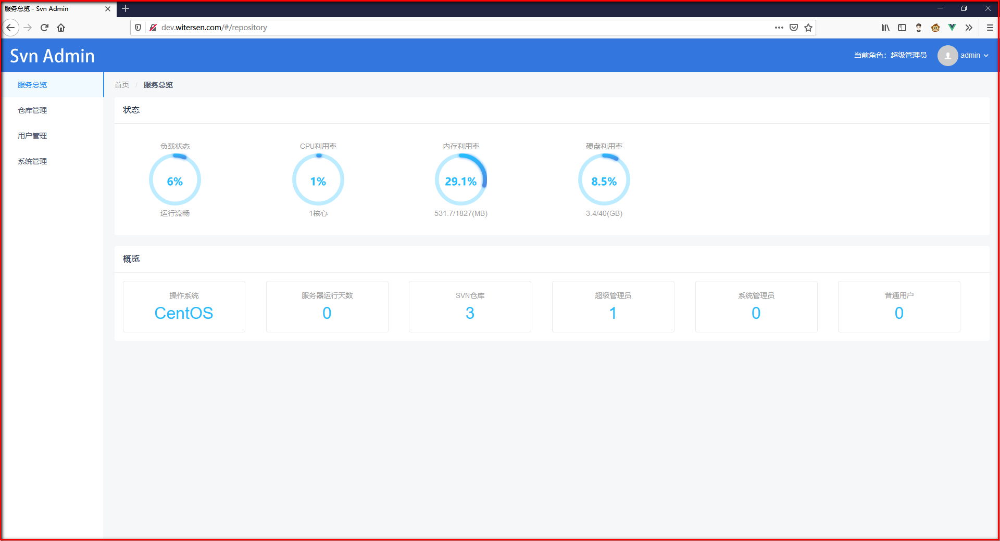
### 2、添加仓库
- 通过添加仓库按钮可以在系统中新建SVN存储库
- 在输入框输入仓库名称，点击确定，即可添加仓库
- 添加后可看到仓库列表处我们新添加的仓库
 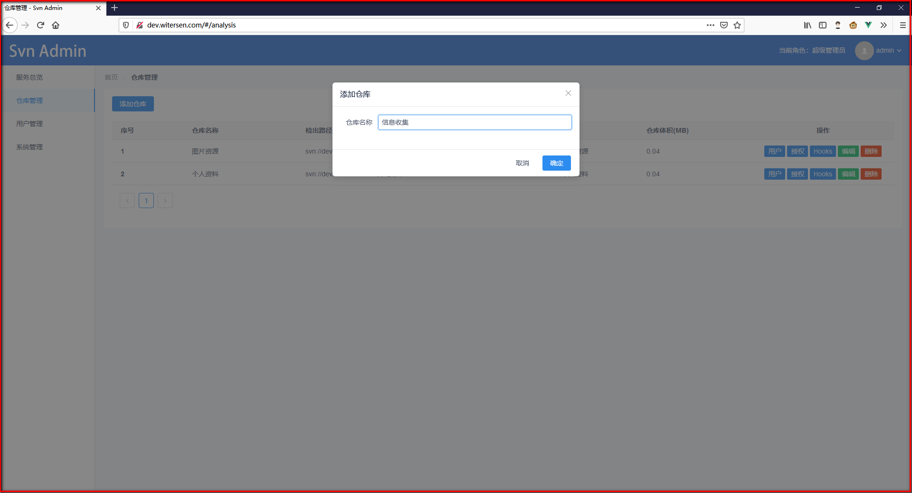
  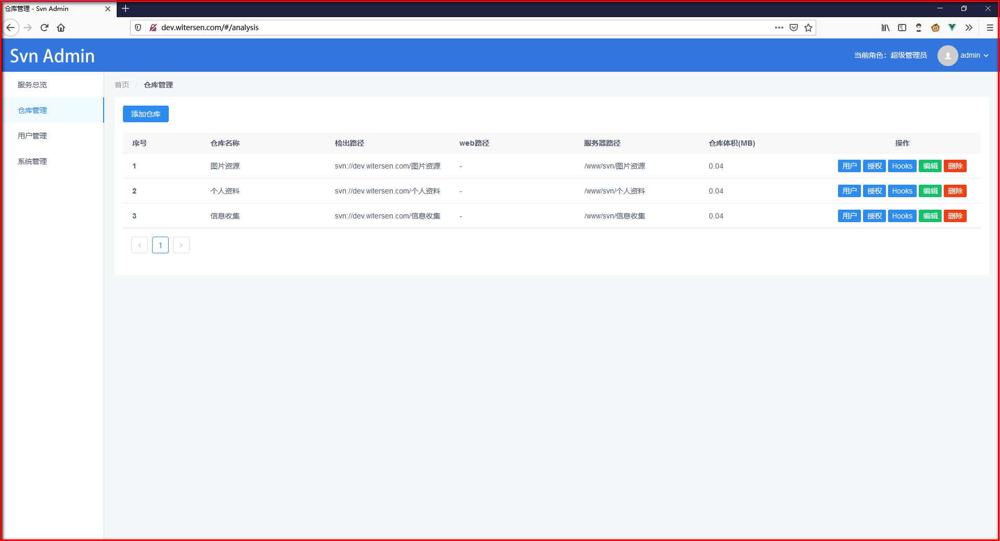
### 3、SVN仓库用户账户管理
- 针对某一仓库点击右侧用户按钮，可看到当前该仓库的用户信息
- 每个被创建的仓库默认包含一个root用户，其密码为随机生成
- 可通过点击添加用户按钮进行新用户的添加
- 通过添加用户可为该仓库添加使用用户
- 通过编辑按钮可对添加的账户信息进行修改
 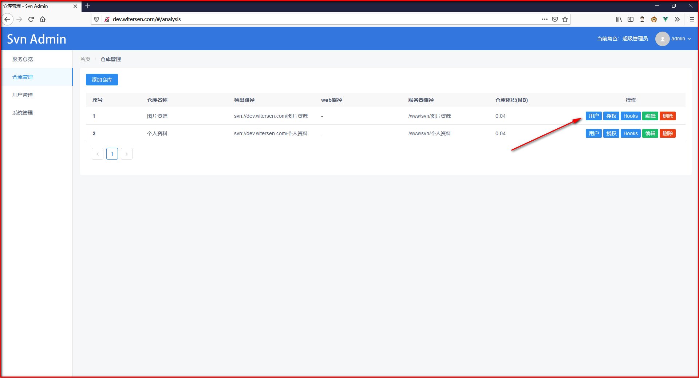
  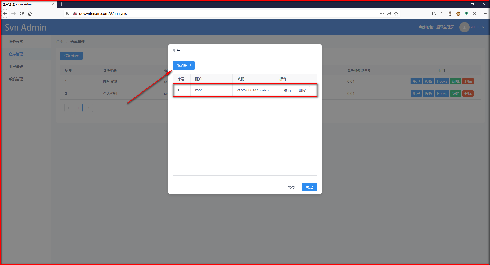
  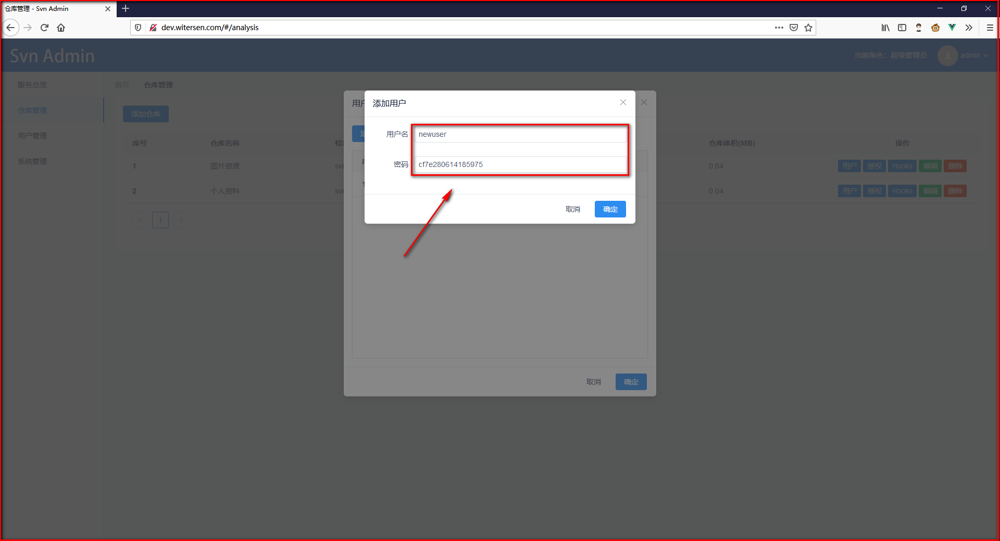

### 4、SVN仓库用户权限管理

- 新添加的用户默认无对SVN存储库的任何权限
- 用户有三种权限模式，分别为可读写、只可读、无权限
- 我们可点击仓库列表右侧的授权按钮对账户进行授权
 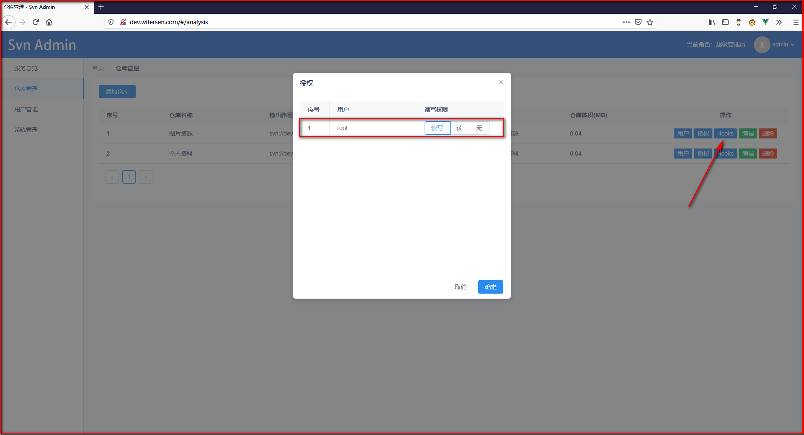
### 5、为SVN仓库设置服务端预处理规则
- 我们可通过为SVN仓库设置钩子功能来进行高级自定义设置
- 不同类型的钩子在不同的时刻起作用
- 点滴 个人资料 仓库右侧的hooks按钮 选择 post-commit 类型并写入命令
- 命令的意思为 在用户提交资料到SVN服务器后，服务器自动将内容更新到指定的目录
 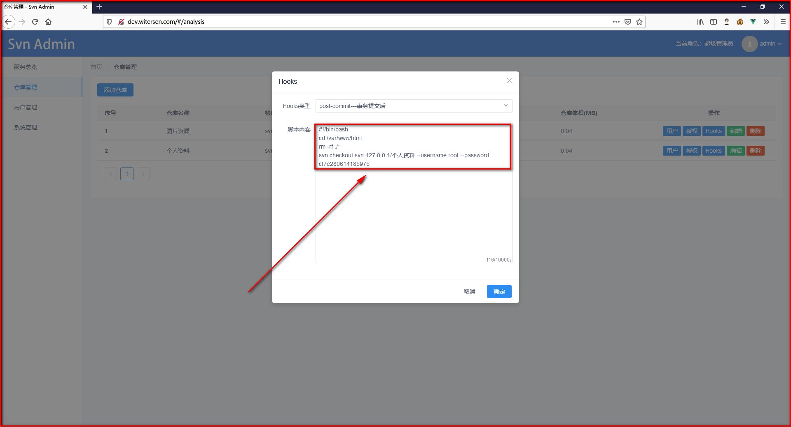
### 6、管理系统用户账户管理
- 可通过添加用户按钮进行管理系统用户的添加
- 用户有三种角色，超级管理员角色为内置角色，不可通过添加的方式进行添加
- 我们通过点击添加用户用户按钮来添加用户信息
- 用户信息中的邮件信息可作为个人接收系统关键通知信息的方式
 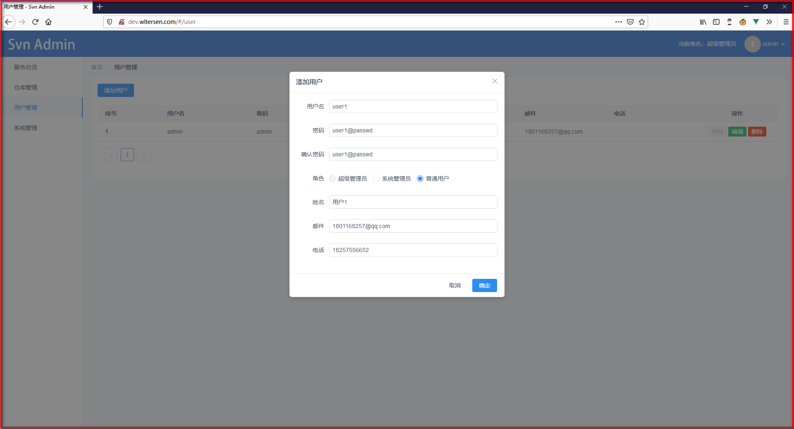
### 7、管理系统用户权限管理
- 超级管理员和系统管理员具有对系统管理的全部管理权限，默认可管理所有用户
- 普通用户可通过管理员对其账户授权的方式来获得仓库的使用权
- 授权后用户登录自己的账户可看到已经被授权使用的仓库
 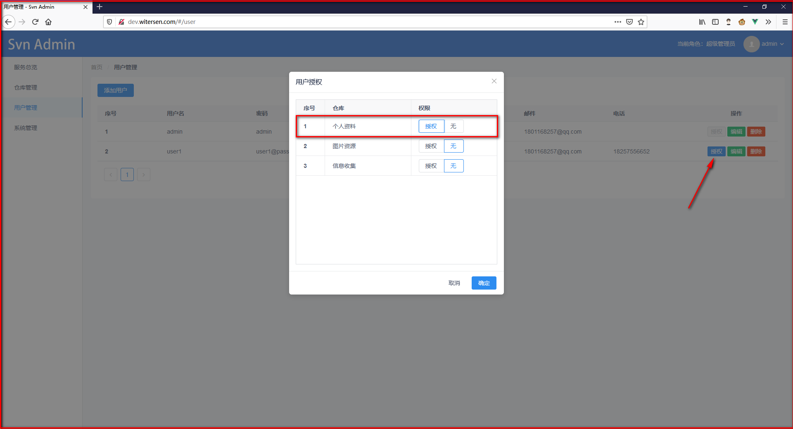
### 8、服务器基础信息配置
- 管理员可通过填写和修改基础配置中的信息来对服务器信息进行修改
- 管理员可通过修改版本库父文件夹来更改SVN储存库的存储路径
- 管理员通过修改备份目录来更改SVN仓库备份文件的存储路径
- 管理员可通过消息通知按钮来设置系统的消息推送开关，开启后，当发生用户登录、SVN仓库删除等信息会发送邮件通知到管理员邮箱
 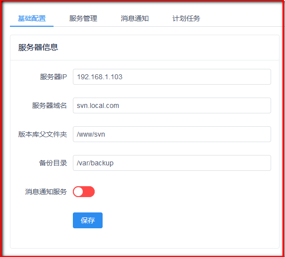
### 9、系统服务管理
- 管理员可在此对与SVN相关的系统服务器状态进行管理
- SVN服务管理中，管理员可通过开启和管理SVN服务按钮来管理系统的SVN状态，当状态显示为已停止代表所有SVN用户不能对SVN仓库进行操作
- 当初次使用本系统或不再使用本系统，可通过安装和卸载服务卸载SVN服务后退出系统
- 当SVN仓库出现异常如手动在目录下增加了SVN仓库文件，可通过修复异常按钮将新添加的SVN仓库添加到系统管理范畴
- 防火墙服务中，TCP 80 3690 443分别为web服务的常用端口、SVN服务的常用端口、HTTPS服务的常用端口，管理员可通过点击快捷放行按钮放行对应的端口使对应的服务启用
 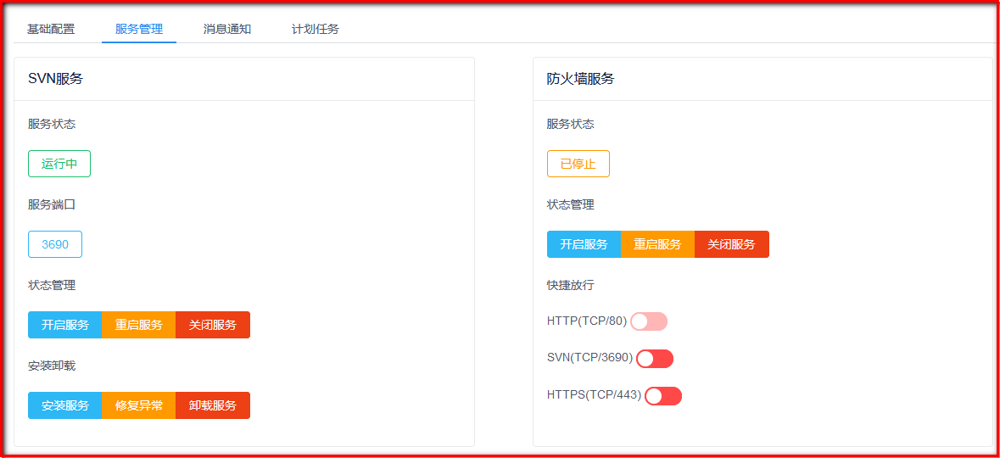
### 10、消息通知服务
- 管理员可通过添加邮件服务器配置信息来进行系统消息服务的配置
- 添加配置信息后可通过发送测试邮件来对填写的配置信息进行测试
 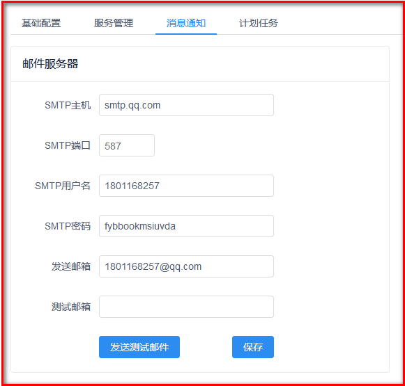
- 测试成功信息如下图所示
 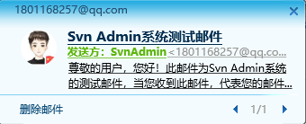
### 11、计划任务备份【功能未实现 会在后续版本开发】
- 为了保障SVN存储库的数据安全，我们提供了定时备份功能
- 管理员可通过设置，在服务器工作不繁忙的时候进行仓库备份，如可通过添加每日凌晨1点30分进行备份的任务计划来备份仓库
- 添加后的任务计划会出现在下方列表中，管理员不需要备份时可选择删除
 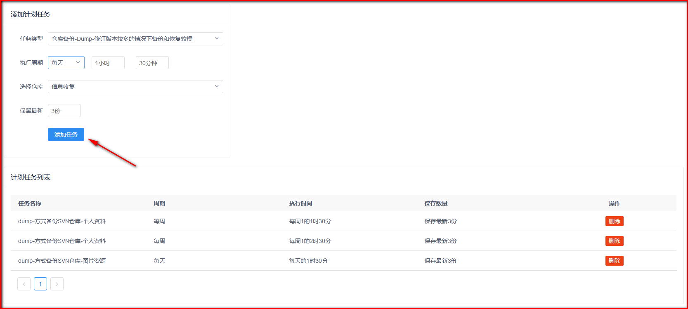
### （二）客户端工具介绍与使用

### 1、客户端工具程序获取和安装
- 访问 TortoiseSVN 官网，下载对应的客户端工具和中文语言包，如图所示
 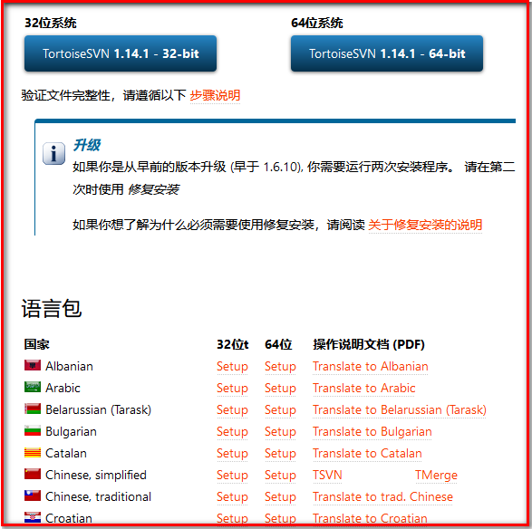
- 依次安装客户端工具和语言包
### 2、设置工具语言
- 都安装完成后，在桌面空白处右键，依次选择TortoiseSVN、设置、常规设置、语言，将语言调整为简体中文，如图所示
 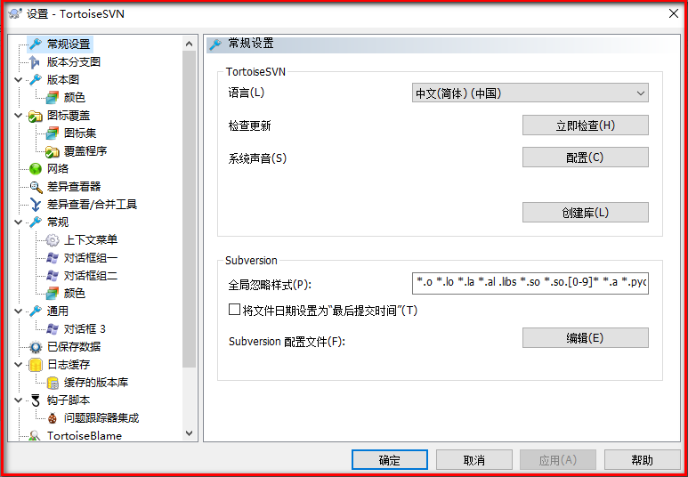